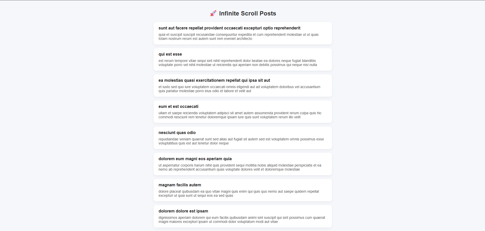

# 🚀 Infinite Scroll List (React)

A production-style Infinite Scroll implementation built with React. This project demonstrates how to efficiently load data as the user scrolls, similar to modern applications like social media feeds.

---

## 📌 Features

* 🔄 Infinite scrolling (auto load on scroll)
* 📡 API integration with pagination
* ⚡ Optimized performance using throttle
* ⛔ Prevents multiple API calls
* 🎯 Clean and responsive UI design
* 🔁 Dynamic data rendering

---

## 🧠 Problem Solved

Traditional pagination can interrupt user experience.
This project solves that by implementing **infinite scrolling**, where data loads automatically as the user reaches the bottom of the page.

---

## 🛠️ Tech Stack

* React (Hooks)
* JavaScript (ES6+)
* Axios
* CSS (Custom styling)

---

## ⚙️ Installation & Setup

```bash
# Clone the repository
git clone https://github.com/your-username/infinite-scroll-app.git

# Navigate to project
cd infinite-scroll-app

# Install dependencies
npm install

# Run the app
npm run dev
```

---

## 📂 Project Structure

```
src/
 ├── components/
 │    └── InfiniteScroll.jsx
 ├── App.jsx
 ├── main.jsx
 └── index.css
```

---

## 🔍 How It Works

1. Fetch data from API using pagination (`_page`, `_limit`)
2. Detect scroll position using `window.scroll`
3. When user reaches bottom → trigger next page load
4. Append new data to existing state
5. Use loading state to prevent duplicate calls
6. Apply throttle to optimize performance

---

## ⚡ Key Learning Points

* Managing large lists efficiently
* Scroll event handling
* Performance optimization (throttle)
* Clean state management with React Hooks
* Real-world API handling

---

## 📸 Preview



---

## 🤝 Contributing

Feel free to fork this repo and improve it!

---

## 📬 Connect With Me

* GitHub: https://github.com/jihadsoyon
* LinkedIn: https://www.linkedin.com/in/jihad-soyon

---

⭐ If you found this project useful, give it a star!
