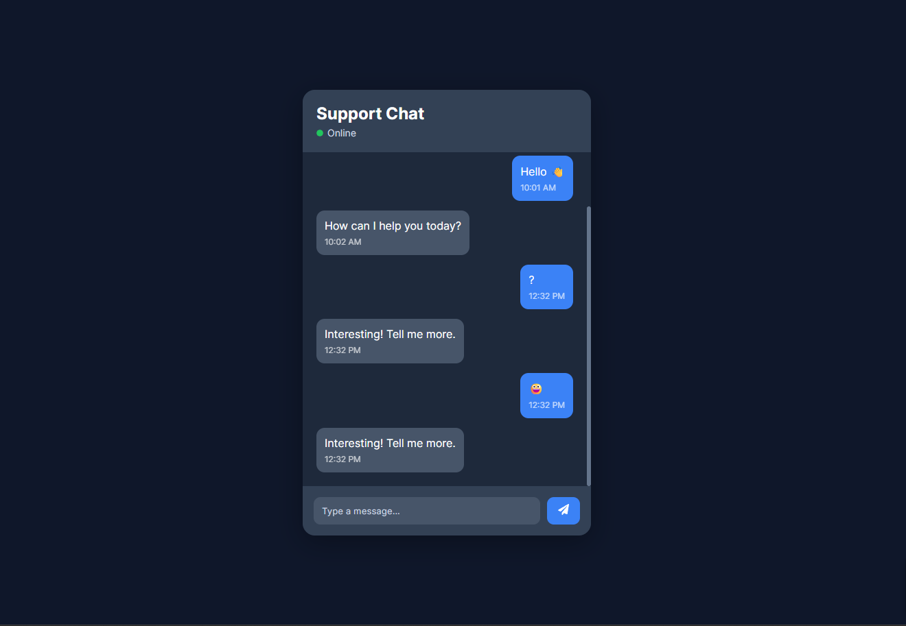

# 🚀 Real-Time Chat UI

A modern SaaS-style chat interface built with React that simulates real-time messaging behavior with typing indicators, auto-scroll functionality, and a clean component-based architecture.

## Problems Solved

* Real-time message synchronization
* Automatic scrolling to latest messages
* Typing state management
* Reusable component architecture
* Chat UI responsiveness
* Dynamic message rendering

## Features

* Real-time chat interface
* Send and display messages instantly
* Typing indicator
* Auto scroll to newest message
* Modern SaaS-inspired design
* Responsive layout
* Component-based architecture
* Clean state management

## ScreenShot

## Tech Stack

* React
* JavaScript (ES6+)
* CSS3
* React Icons
* Vite
